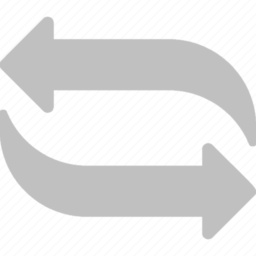
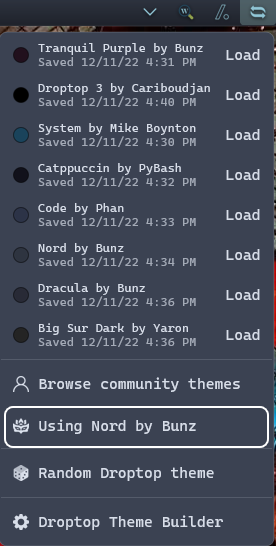

<h1 align="center">
   
  
   
  Theme Me
   
</h1>

<h4 align="center">Allows you to select a random Droptop theme and you can save up to eight custom themes and hot load them. No need to install a custom theme again once it is saved.</h4>

  
  
  
  

  <a href="#key-features">Key Features</a> •
  <a href="#how-to-use">How To Use</a> •
  <a href="#download">Download</a> •
  <a href="#credits">Credits</a> •
  <a href="#license">License</a>

## Key Features
Toggle Theme Previews
Random theme every 24hrs , 1hr or 1 minute.
Toggle random theme feature on/off
Shows you the theme you are currently using.

## How to use
Left click on slot to save theme.  Left click on "Load" to load saved theme. Left click on the "Using them X" button to access all Droptop themes.

## Download
https://github.com/papa-boynton/Theme_Me-Mike_Boynton/releases/latest

## Credits
Written by [TheyCallMePapa](https://github.com/papa-boynton) in collaboration with [Cariboudjan](https://github.com/Droptop-Four/)

## License
Creative Commons Attribution-Non-Commercial-Share Alike 3.0
